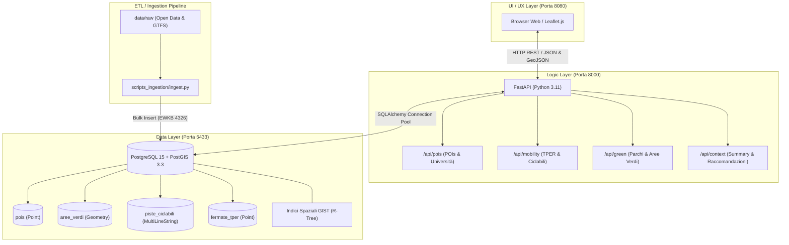

# Student Urban Accessibility Advisor 🎓🗺️
## Guida Completa all'Architettura, ai File e alla Presentazione d'Esame

> **Corso:** Context-Aware Systems (CAS)  
> **Progetto:** Proposta 4 – *Student Urban Accessibility Advisor*  
> **Target:** Studio individuale e supporto alla discussione con il Docente.

---

## 📑 Indice dei Contenuti
1. [Inquadramento Concettuale: Cos'è il Progetto e perché è Context-Aware](#1-inquadramento-concettuale)
2. [Architettura del Sistema e Flusso dei Dati](#2-architettura-del-sistema)
3. [Mappa Dettagliata File per File](#3-mappa-dettagliata-file-per-file)
   - [Configurazione e Orchestrazione (Root)](#31-configurazione-e-orchestrazione)
   - [Database e Inizializzazione Spaziale (`database/`)](#32-database-e-inizializzazione-spaziale)
   - [Data Ingestion e Dataset (`backend/scripts_ingestion/` e `data/`)](#33-data-ingestion-e-dataset)
   - [Backend Core e Routing API (`backend/`)](#34-backend-core-e-routing-api)
   - [Frontend Web (`frontend/`)](#35-frontend-web)
4. [Fondamenti di Calcolo Geospaziale (Focus per il Docente)](#4-fondamenti-di-calcolo-geospaziale)
5. [Domande Tipiche del Docente con Risposte Pronte (Q&A d'Esame)](#5-domande-tipiche-del-docente-qa-desame)

---

## 1. Inquadramento Concettuale

### Cos'è il progetto?
Lo **Student Urban Accessibility Advisor** è una piattaforma web geospaziale *context-aware* progettata per gli studenti universitari della città di Bologna. Il sistema analizza l'accessibilità urbana e consiglia le zone migliori in cui vivere, studiare o spostarsi in base a preferenze personali e vincoli contestuali.

### Perché il sistema è "Context-Aware" e non una semplice mappa GIS?
Un sistema GIS tradizionale mostra dati statici uguali per tutti. Il nostro sistema è **context-aware** perché adatta dinamicamente le informazioni e i suggerimenti sulla base di molteplici dimensioni del contesto:
1. **Contesto Spaziale (Location):** Coordinate GPS correnti dell'utente o un'area di interesse selezionata sulla mappa, con raggio di mobilità pedonale/ciclabile (300m - 1000m).
2. **Contesto Utente (Preferenze):** Pesi assegnati dall'utente ai diversi servizi urbani (es. studente che privilegia le aule studio e i bus rispetto alle aree verdi).
3. **Contesto Ambientale (Densità dei Servizi):** Misurazione della saturazione o del "deserto dei servizi" attorno a una posizione.
4. **Contesto Temporale (Time-Awareness):** Apertura effettiva delle aule studio/biblioteche in base alla fascia oraria (diurna vs notturna).

---

## 2. Architettura del Sistema

Il progetto adotta un'architettura a **microservizi disaccoppiati**, orchestrata tramite **Docker Compose**:

### Le scelte architetturali chiave:
* **Perché PostGIS e non calcoli in Python?** Delegare le query spaziali (`ST_DWithin`, `ST_Distance`) direttamente al database sfrutta gli indici spaziali **GIST (R-Tree)** scritti in C, riducendo i tempi di risposta da centinaia di millisecondi a pochissimi millisecondi, senza saturare la RAM dell'interprete Python.
* **Perché Web-Based e non App Mobile nativa?** La Proposta 4 specifica che l'app mobile è opzionale. Una Web Dashboard responsive con Leaflet.js consente la piena fruizione da browser desktop e smartphone, dimezzando i costi di manutenzione e concentrando gli sforzi sulla qualità degli algoritmi spaziali e contestuali.

---

## 3. Mappa Dettagliata File per File

### 3.1. Configurazione e Orchestrazione

| File | Scopo e Ruolo Tecnico |
| :--- | :--- |
| **`docker-compose.yml`** | Definisce i 3 container (`urban_db`, `urban_backend`, `urban_frontend`), le porte host-guest (`5433:5432`, `8000:8000`, `8080:80`), i volumi persistenti (`contextawareproject_db_data`) e le variabili di ambiente. Permette di avviare l'intero stack con `docker compose up -d`. |
| **`.env`** | Centralizza le credenziali di default del database (`DB_USER`, `DB_PASSWORD`, `DB_NAME`, `DB_PORT`) evitando di inserire password in chiaro nel codice sorgente. |
| **`.gitignore`** | Esclude dal controllo versione i file temporanei Python (`__pycache__`, `*.pyc`), ambienti virtuali locali e file di sistema (`.DS_Store`). |
| **`README.md`** | Vetrina e documentazione del repository: panoramica architetturale, elenco delle tecnologie, tabella degli endpoint REST attivi e comandi operativi. |

---

### 3.2. Database e Inizializzazione Spaziale (`database/`)

| File | Scopo e Ruolo Tecnico |
| :--- | :--- |
| **`database/init-scripts/01_init.sql`** | Eseguito automaticamente da PostgreSQL al primo avvio del container. Abilita l'estensione geospaziale `CREATE EXTENSION postgis;`, dichiara lo schema delle 4 tabelle (`pois`, `aree_verdi`, `piste_ciclabili`, `fermate_tper`) con coordinate standard WGS84 (`SRID 4326`), e crea i 4 indici spaziali **GIST** per garantire ricerche ad alta velocità. |

---

### 3.3. Data Ingestion e Dataset (`backend/scripts_ingestion/` e `data/`)

| File | Scopo e Ruolo Tecnico |
| :--- | :--- |
| **`backend/scripts_ingestion/ingest.py`** | Script Python di Data Cleaning ed ETL (Extract, Transform, Load). Legge i file grezzi in `data/raw/`, scarta record corrotti/nulli, converte tutte le coordinate in EPSG:4326, normalizza i tipi geometrici (`MultiPoint` $\rightarrow$ `Point`, `LineString` $\rightarrow$ `MultiLineString`) e inserisce oltre 9.000 record nel DB in formato binario spaziale compresso **EWKB** usando `GeoPandas` e `GeoAlchemy2`. |
| **`data/raw/mappe-unibo.csv`** | Open Data Unibo: sedi universitarie didattiche, dipartimenti e musei universitari di Bologna. |
| **`data/raw/biblioteche-comunali-di-bologna.geojson`** | Open Data Comune di Bologna: biblioteche comunali con posizione geografica esatta. |
| **`data/raw/rastrelliere-per-biciclette.geojson`** | Open Data Comune di Bologna: oltre 1.000 rastrelliere per sosta biciclette. |
| **`data/raw/carta-tecnica-comunale-toponimi-parchi-e-giardini.geojson`** | Open Data: toponimi e parchi urbani della città. |
| **`data/raw/piste-ciclopedonali.geojson` e `biciplan-...geojson`** | Open Data: tracciati vettoriali della rete ciclabile comunale e del Biciplan. |
| **`data/raw/gommagtfsbo_20260709.zip`** | Feed ufficiale GTFS di TPER: contiene `stops.txt` con le oltre 6.300 fermate del trasporto pubblico urbano e suburbano. |

---

### 3.4. Backend Core e Routing API (`backend/`)

| File | Scopo e Ruolo Tecnico |
| :--- | :--- |
| **`backend/Dockerfile`** | Immagine Docker Python 3.11-slim con le librerie di compilazione necessarie (`gcc`, `g++`, librerie GEOS/GDAL). |
| **`backend/requirements.txt`** | Dipendenze Python: `fastapi`, `uvicorn`, `SQLAlchemy`, `psycopg2-binary`, `GeoAlchemy2`, `geopandas`, `shapely`, `pandas`. |
| **`backend/main.py`** | Entrypoint FastAPI: inizializza l'applicazione, configura `CORSMiddleware` (per consentire le chiamate dal browser web senza errori di sicurezza), registra i 4 router modulari ed espone l'endpoint di diagnostica `/api/health` che interroga `PostGIS_Version()`. |
| **`backend/database.py`** | Gestore della connessione: istanzia l'engine SQLAlchemy (`postgresql+psycopg2://`) con pool pre-configurato (`pool_pre_ping=True`) ed espone la dependency injection `get_db()` che fornisce sessioni isolate chiudendole automaticamente al termine di ogni richiesta. |
| **`backend/api/schemas.py`** | Modelli Pydantic di validazione e serializzazione (`POIItem`, `BusStopItem`, `GreenAreaItem`, `PointCoordinates`): assicurano risposte JSON conformi e generano la documentazione automatica OpenAPI (Swagger). |
| **`backend/api/pois.py`** | Router per i Punti di Interesse: implementa `GET /api/pois/categories`, `GET /api/pois/nearby` (ricerca per raggio con calcolo distanza metrica tramite `ST_DWithin` e `ST_Distance`) e `GET /api/pois/{id}`. |
| **`backend/api/mobility.py`** | Router per la mobilità: implementa `GET /api/mobility/stops/nearby` (fermate TPER vicine) e `GET /api/mobility/bikepaths` (esportazione nativa in GeoJSON `FeatureCollection` con supporto al filtro Bounding Box). |
| **`backend/api/green.py`** | Router per il verde urbano: implementa `GET /api/green/nearby` (ricerca parchi con calcolo distanza dal baricentro `ST_Centroid`) e `GET /api/green/areas` (GeoJSON per la mappa). |
| **`backend/api/context.py`** | Router per l'analisi contestuale: implementa `GET /api/context/summary` (calcolo densità aggregata e distanze minime da tutti i servizi nel raggio, flag di presenza e sintesi testuale qualitativa); predisposto per il motore di raccomandazione pesato della Fase 4. |

---

### 3.5. Frontend Web (`frontend/`)

| File | Scopo e Ruolo Tecnico |
| :--- | :--- |
| **`frontend/Dockerfile`** | Immagine Nginx Alpine ad alta efficienza per servire i file statici HTML/JS/CSS sulla porta `8080`. |
| **`frontend/index.html`** | Struttura semantica della dashboard: header con status live delle API, sidebar controlli (preset rapidi, slider buffer raggio, toggle layer tematici, card metriche live e slider preferenze) e container `#map`. |
| **`frontend/app.js`** | Logica client-side Leaflet.js: basemap Esri Dark Gray Canvas, gestione layer multipli, interazione al click con cerchio di prossimità (`L.circle`), marker dello studente draggabile, chiamate asincrone `fetch()` alle API REST e aggiornamento dinamico dei dati. |
| **`frontend/style.css`** | Design system moderno: variabili CSS, Dark Mode ad alto contrasto, pannelli in glassmorphism, palette colori distintiva per i servizi e transizioni fluide. |

---

## 4. Fondamenti di Calcolo Geospaziale

Durante la discussione, il professore potrebbe approfondire le scelte matematiche e informatiche alla base del GIS:

### 1. Sistema di Coordinate: SRID 4326 (WGS 84)
* **Cos'è:** Il sistema di riferimento geodetico standard globale utilizzato dal GPS (latitudine e longitudine in gradi decimali).
* **Perché lo usiamo:** Tutti i client di Web Mapping (Leaflet, OpenStreetMap) comunicano nativamente in coordinate WGS 84.

### 2. Geometry vs Geography in PostGIS
* `GEOMETRY`: Calcola le distanze su un piano cartesiano euclideo piatto ($\sqrt{\Delta x^2 + \Delta y^2}$). A livello di gradi geografici, questo calcolo genererebbe errori enormi perché la Terra è sferica/ellissoidale.
* `GEOGRAPHY`: PostGIS converte le coordinate e calcola la distanza reale sulla superficie dell'ellissoide terrestre (formula del grande cerchio / Vincenty), restituendo il valore **esatto in metri**.
* **Nelle nostre query:** Usiamo il cast `geom::geography` all'interno di `ST_DWithin` e `ST_Distance` per esprimere i raggi di ricerca (es. `500m`) direttamente in metri e con precisione millimetrica.

### 3. Indici Spaziali GIST (R-Tree)
* **Come funzionano:** Invece di ordinare valori scalari lineari come un B-Tree tradizionale, un indice **GIST (Generalized Search Tree)** implementa una struttura **R-Tree**, che raggruppa le geometrie all'interno di rettangoli minimi delimitatori (**Bounding Box - MBR** gerarchici).
* **Guadagno prestazionale:** Una ricerca per raggio senza indice richiede una scansione sequenziale $O(N)$ di tutti i record del database. Con l'indice GIST, PostGIS scarta interi rami dell'albero che non intersecano l'area di ricerca, riducendo la complessità a $O(\log N)$ ed eseguendo la query in circa **2-5 millisecondi** anche su migliaia di geometrie.

---

## 5. Domande Tipiche del Docente (Q&A d'Esame)

### D1: *"Perché avete scelto un'architettura a microservizi con Docker?"*
> **Risposta:**  
> *"L'architettura a microservizi garantisce completo disaccoppiamento e riproducibilità dell'ambiente. Il database con PostGIS richiede dipendenze di sistema native (GEOS, GDAL, PROJ) che possono creare conflitti su macchine host differenti. Con Docker Compose, l'infrastruttura si avvia con un singolo comando su qualsiasi sistema operativo, mantenendo il database persistente tramite volumi dedicati e separando nettamente il livello logico (FastAPI) da quello di presentazione (Nginx)."*

### D2: *"In che modo avete gestito il problema delle diverse proiezioni dei dati grezzi?"*
> **Risposta:**  
> *"Nello script di data ingestion `ingest.py`, abbiamo utilizzato GeoPandas per verificare il CRS (Coordinate Reference System) di ciascun dataset. Tutti i file non-WGS84 sono stati riproiettati esplicitamente a `EPSG:4326`. Inoltre, i dataset che contenevano geometrie eterogenee (es. `MultiPoint` o `LineString` isolate) sono stati normalizzati prima dell'inserimento per rispettare rigorosamente i vincoli di tipo delle tabelle PostGIS."*

### D3: *"Perché non avete filtrato i dati direttamente in Python caricando tutto in memoria?"*
> **Risposta:**  
> *"Caricare migliaia di coordinate complesse in memoria RAM con Python comporterebbe un consumo eccessivo di risorse e una pessima scalabilità concorrente. PostGIS è scritto in C, risiede nello stesso engine dei dati e dispone di indici spaziali GIST (R-Tree). Delegare al database il filtraggio con `ST_DWithin` consente a FastAPI di ricevere dal DB esclusivamente i record già filtrati e ordinati per distanza, minimizzando il traffico di rete interno e la latenza."*

### D4: *"Come si articola l'aspetto Context-Aware del progetto?"*
> **Risposta:**  
> *"Il sistema opera secondo il paradigma context-aware: acquisisce il contesto primario dell'utente (posizione geografica e orario) e il contesto delle preferenze (pesi assegnati a studio, trasporti e mobilità ciclabile). Attraverso l'endpoint di analisi contestuale (`/api/context/summary`), il sistema aggrega la densità dei servizi circostanti e calcola un punteggio dinamico pesato (Student Accessibility Score), accompagnando il risultato con una raccomandazione testuale motivata e applicando meccanismi di temporal-filtering e spatial-privacy."*
